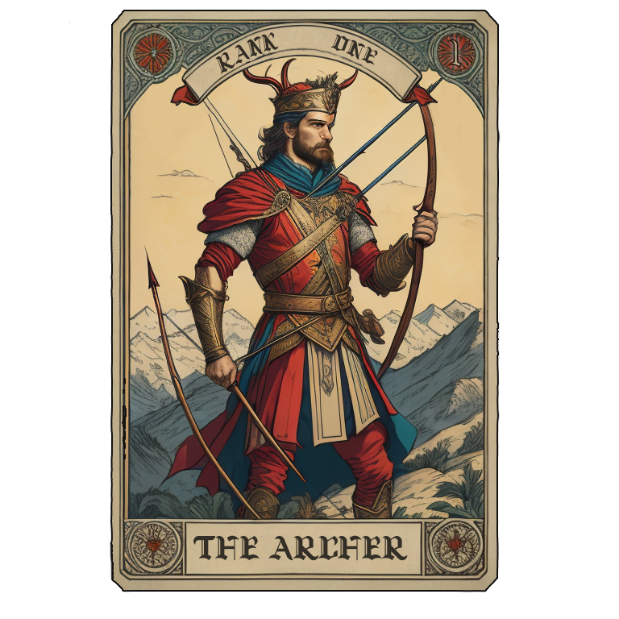

# M.A.S.T.R. Tactics

## A two-player websockets fantasy-themed game expanding on the classic Rock-Paper-Scissors.

Are you ready for a battle of epic proportions? 

Introducing M.A.S.T.R. Tactics (Mage-Archer-Sorcerer-Templar-Rogue), an uproarious two-player expanded rock-paper-scissors game! 

Each player chooses one of the five characters—Mage, Archer, Rogue, Sorcerer, or Templar—and strategically attempt to outwit their opponent. 

*  ***Magicians*** use mysticism to turn spells into powerful attacks

*  ***Archers*** find cunning and deadly accurate with bows and arrows

*  ***Sorcerers*** harness the power of nature to overcome obstacles 

*  ***Templars*** use the devine power of the gods to deliver justice

*  ***Rogues*** rely on agility to swiftly crush any opposition

Will you select your champion wisely, or will you be vanquished? Join the battle now and see whose mettle will prevail!

## RULES

The character *deck* is randomized and a *hand* of 5 cards are dealt to both players.

Each player chooses a **3-card battle-party** from their *hand* of five-random cards drawn from a common character *deck*, and places them face down, in opposition to the party selected by your opponent.

Both players reveal their choices and the BATLLE BEGINS!  A battle is a set of three face-to-face skirmishes.

Each character-class is vulnerable to attack from its nemisis class as shown:

*  ***Magicians*** are defeated by *rogues* and *sorcerors*.

*  ***Archers*** are defeated by *templars* and *magicians*.

*  ***Sorcerers*** are defeated by *archers* and *rogues*.

*  ***Templars*** are defeated by *sorcerors* and *magicians*.

*  ***Rogues*** are defeated by *templars* and *archers*.

If two members of the same character class clash during battle, the party-member with the higher class wins the skirmish between the two.

Each player collect a point for each victorious skirmish in the battle. 

Only 3-points are awarded per battle (1 per skirmish).

The winner (best 2/3) of the battle recieves a bonus point as the spoils of battle.

All played cards then move to a communal discard pile, and each player draws 3 more character-cards from the communal deck.

If the deck runs out of character cards, the discard pile is randomized and becomes a new communal deck.

The games ends when a player reaches 10 points.

## The leader board

After each battle, players accumulate points for a ranked high-score board.

